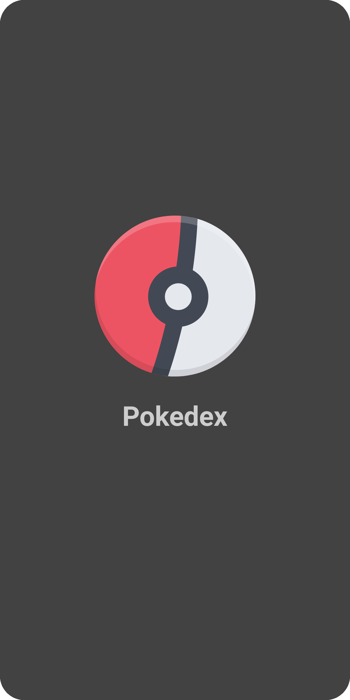
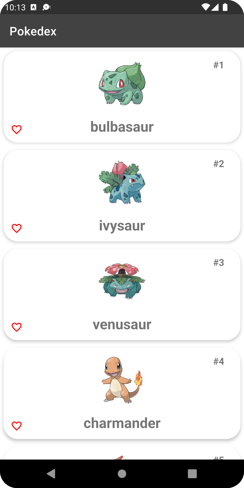
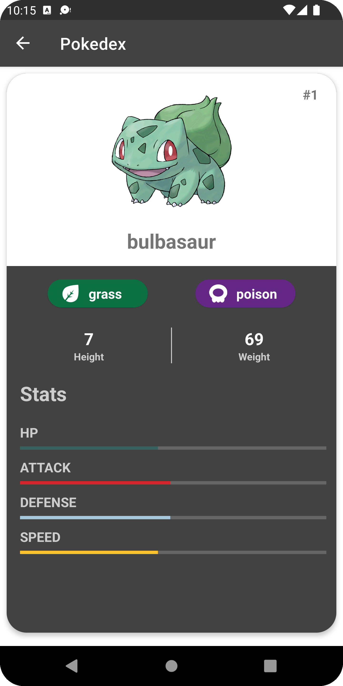

# Pokedex - Android App 


## About

<div style="text-align: right"> Pokedex is an Pokémon Database app for Android. It is based on PokéAPI and powered by Kotlin. The app uses apollo graphql to fetch data and allows users to view Pokémons and add them to their favorites created with modern Android development tools and libraries. </div>

\
&nbsp;

## Screenshots
<p float="left">

  &nbsp; &nbsp; &nbsp;

   &nbsp; &nbsp; &nbsp;

</p>

## ✨ Features ✨
- Splash screen
- Home screen
- Details screen
- Night & Day mode support

## Application Development

### RoadMap :calendar:
- Search pokemons
- Pagination

#### Language

- Kotlin

#### Tools

- Android Studio (Chipmunk) 🐿️

#### Android

Minimum SDK version 23
Target SDK version 32

#### Libraries
- [AndroidX](https://developer.android.com/jetpack/androidx)
- [Timber](https://github.com/JakeWharton/timber)
- [Material Design](https://github.com/material-components/material-components-android)
- [Hilt](https://developer.android.com/training/dependency-injection/hilt-android)
- [Junit](https://developer.android.com/training/testing/unit-testing/local-unit-tests)
- [ViewModel](https://developer.android.com/topic/libraries/architecture/viewmodel)
- [Coroutines](https://kotlinlang.org/docs/coroutines-guide.html)
- [Coil](https://coil-kt.github.io/coil/)
- [Navigation](https://developer.android.com/topic/libraries/architecture/navigation)
- [Room](https://developer.android.com/topic/libraries/architecture/room)
- [Gradle Kotlin DSL](https://docs.gradle.org/current/userguide/kotlin_dsl.html)
- [Espresso](https://developer.android.com/training/testing/espresso)
- [Junit](https://developer.android.com/training/testing/local-tests)
- [Okhttp](https://square.github.io/okhttp/)
- [Apollo-Graphql](https://www.apollographql.com/)
- [Mockk](https://mockk.io/)
- [Lottie](https://lottiefiles.com/)
- [UI-Automator](https://developer.android.com/training/testing/other-components/ui-automator)
- [Gradle Kotlin DSL](https://docs.gradle.org/current/userguide/kotlin_dsl.html)
- [Gradle version catalog](https://docs.gradle.org/current/userguide/platforms.html)

## Installation

Clone this repository and import into Android Studio

## Maintainers

This project is mantained by: [pako1](https://github.com/pako1) 

## License

This application is released under MIT (see [LICENSE](LICENSE)).
Some of the used libraries are released under different licenses.

```
MIT License

Copyright (c) 2022 Filipos katzilieris

Permission is hereby granted, free of charge, to any person obtaining a copy
of this software and associated documentation files (the "Software"), to deal
in the Software without restriction, including without limitation the rights
to use, copy, modify, merge, publish, distribute, sublicense, and/or sell
copies of the Software, and to permit persons to whom the Software is
furnished to do so, subject to the following conditions:

The above copyright notice and this permission notice shall be included in all
copies or substantial portions of the Software.

THE SOFTWARE IS PROVIDED "AS IS", WITHOUT WARRANTY OF ANY KIND, EXPRESS OR
IMPLIED, INCLUDING BUT NOT LIMITED TO THE WARRANTIES OF MERCHANTABILITY,
FITNESS FOR A PARTICULAR PURPOSE AND NONINFRINGEMENT. IN NO EVENT SHALL THE
AUTHORS OR COPYRIGHT HOLDERS BE LIABLE FOR ANY CLAIM, DAMAGES OR OTHER
LIABILITY, WHETHER IN AN ACTION OF CONTRACT, TORT OR OTHERWISE, ARISING FROM,
OUT OF OR IN CONNECTION WITH THE SOFTWARE OR THE USE OR OTHER DEALINGS IN THE
SOFTWARE.
```
